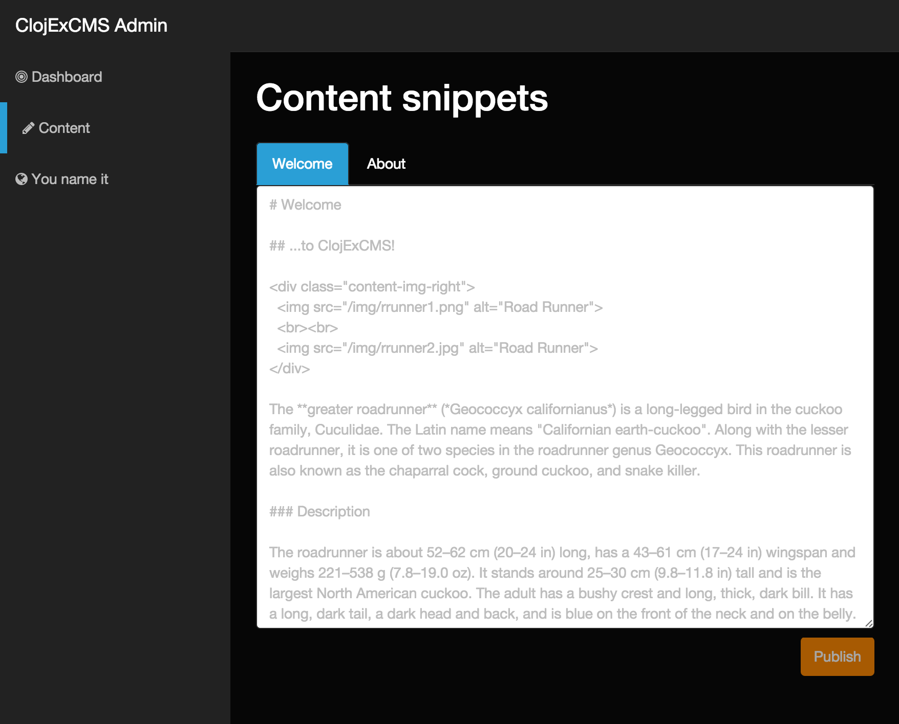
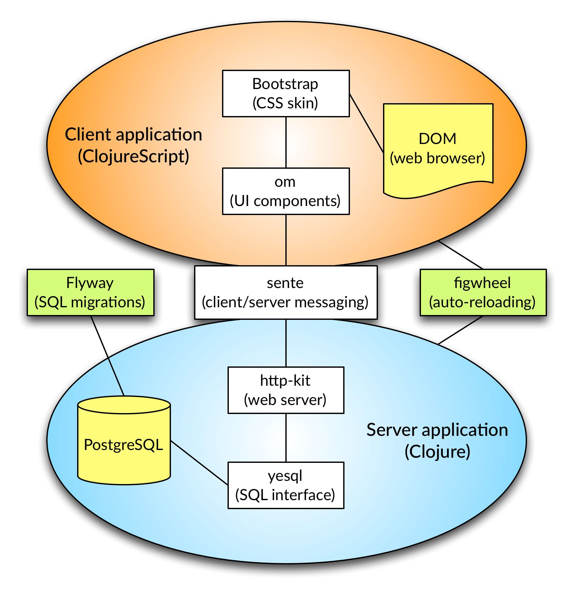

# clojexcms – Clojure(Script) Example CMS

Developed for the [:clojureD conference](http://www.clojured.de) 2015, "Web Applications by Example", Steffen Beyer.

Use this project as an example or as template for your own developments.

*frontend* is the visitor-facing website, *backend* is the administration panel.



## Architecture

(in terms of libraries and building blocks)



* [Light Table](http://lighttable.com/) – Live-coding environment
* [Chestnut](https://github.com/plexus/chestnut) – Application template for ClojureScript/Om with live reloading
* [Figwheel](https://github.com/bhauman/lein-figwheel) – Leiningen plugin that pushes ClojureScript code changes to the client
* [http-kit](http://www.http-kit.org/) – HTTP client/server for Clojure
* [PostgreSQL](http://www.postgresql.org/) – RDBMS
* [Flyway](http://flywaydb.org) – Database migrations
* [Yesql](https://github.com/krisajenkins/yesql) – Simple SQL adapter
* [Sente](https://github.com/ptaoussanis/sente) – Bidirectional messaging via WebSockets/AJAX
* [Om](https://github.com/swannodette/om) – ClojureScript interface to Facebook's React
* [Bootstrap](http://getbootstrap.com/) – HTML, CSS, and JS framework

## Setup

Create a PostgreSQL database and put the config into `project.clj` and `src/clj/clojexcms/database.clj` (see #1).

Seed the database by running

```shell
lein flyway migrate
```

## Light Table Development

Add the folder to your workspace and open `src/clj/clojexcms/server.clj`. Evaluate the file, then evaluate the `(run)` expression at the bottom.

The call to `(run)` does two things, it starts the webserver at port 10555, and also the Figwheel server which takes care of live reloading ClojureScript code and CSS.

View the server starting up in the console.

When you see the line `Successfully compiled "resources/public/js/backend/app.js" in 21.36 seconds.`, you're ready to go. Browse to [`http://localhost:10555`](http://localhost:10555) and enjoy.

## Server Startup via REPL

Open a terminal and type `lein repl` to start a Clojure REPL (interactive prompt).

In the REPL, type

```clojure
(run)
```

## Further References

* [Bret Victor](http://worrydream.com/)
* [Anna Pawlicka: Om nom nom nom (Clojure/conj 2014 talk)](https://www.youtube.com/watch?v=4-oyZpLRQ20&list=PLZdCLR02grLoc322bYirANEso3mmzvCiI&index=3)
* [Brandon Bloom: Local State, Global Concerns](http://blog.circleci.com/local-state-global-concerns/)
* [Stuart Sierra: My Clojure Workflow, Reloaded](http://thinkrelevance.com/blog/2013/06/04/clojure-workflow-reloaded)
* [Anton Astashov: Perfect ClojureScript Development Environment With Vim](http://astashov.github.io/blog/2014/07/30/perfect-clojurescript-development-environment-with-vim/)
* [CircleCI frontend](https://github.com/circleci/frontend)
* [Luminus – A Clojure web framework](http://www.luminusweb.net/)
* [Flux application architecture](http://facebook.github.io/flux/docs/overview.html)

## Skins

* [Dark Admin](http://www.prepbootstrap.com/bootstrap-theme/dark-admin), MIT license
* [Full Width Pics](http://startbootstrap.com/template-overviews/full-width-pics/), Apache 2.0 license

## License

Distributed under the Eclipse Public License version 1.0.
